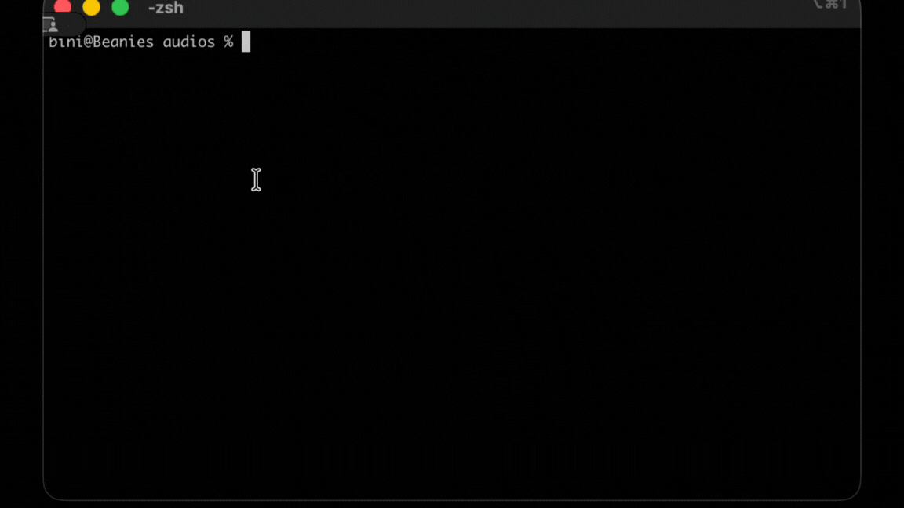

# AI Command Line Assistant

<p align="center">
  
</p>

Transform natural language into shell commands using AI (Claude).

## Quick Start

1. **Install**:
   ```bash
   chmod +x exec-ai
   alias "??"='/path/to/exec-ai'  # Add to ~/.bashrc or ~/.zshrc
   ```

2. **Setup API key**:
   ```bash
   ?? --setup
   ```
   Get your API key at [console.anthropic.com](https://console.anthropic.com/)

3. **Use it**:
   ```bash
   ?? list all running docker containers
   ?? find large files over 100MB
   ?? create a git branch named feature-x
   ```

## Commands

- `?? <description>` - Generate and execute a command
- `?? -y <description>` - Auto-approve and execute
- `?? --setup` - Configure API key
- `?? --history` - Show command history
- `?? --help` - Show help

## Features

- Natural language to commands
- Smart error recovery (retry failed commands)
- System-aware (auto-detects OS, shell, and available tools)
- Interactive approval before execution
- Command history tracking

## Requirements

- curl
- python3
- Anthropic API key

## Roadmap

Future improvements planned:

- [ ] Support for other AI providers (OpenAI GPT, Google Gemini, local models)
- [ ] Edit command before executing (interactive mode)
- [ ] Multi-step command workflows (chain related commands)
- [ ] Command templates and shortcuts
- [ ] Learning from corrections (remember user preferences)
- [ ] Dry-run mode (see what would happen without executing)
- [ ] Context awareness (read current directory files for better suggestions)
- [ ] Shell completion and suggestions
- [ ] Export/import command history
- [ ] Web UI for command history and management

## License

MIT
